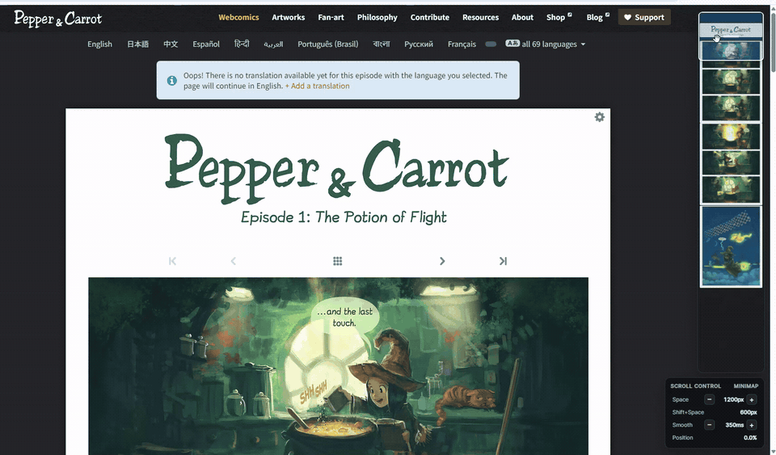

# Webtoon Minimap

**긴 웹툰에서 현재 위치를 보고, 원하는 장면으로 바로 이동하세요.** 원하는 웹사이트에서만 켤 수 있는 Chrome 확장프로그램과 Tampermonkey 사용자 스크립트입니다.

*시연: [Pepper&Carrot 1화](https://www.peppercarrot.com/en/webcomic-sources/ep01_Potion-of-Flight.html), David Revoy 외 기여자, [CC BY 4.0](https://creativecommons.org/licenses/by/4.0/). 화면을 잘라 크기를 줄인 GIF입니다. [전체 출처](docs/IMAGE_CREDITS.md)*

## 설치

### Chrome 확장프로그램

1. [Releases](https://github.com/kwon1h/webtoon-minimap/releases/latest)에서 `webtoon-minimap-1.0.0-chrome.zip`을 받아 **압축을 풉니다**.
2. Chrome에서 `chrome://extensions` → **개발자 모드** → **압축해제된 확장 프로그램을 로드합니다**를 누르고, `manifest.json`이 있는 폴더를 선택합니다.
3. 웹툰 사이트에서 확장프로그램 아이콘 → **이 사이트에서 켜기** → 접근 권한을 승인합니다.

끄려면 확장프로그램 아이콘에서 **이 사이트에서 끄기**를 누르세요.

### Tampermonkey

1. [Releases](https://github.com/kwon1h/webtoon-minimap/releases/latest)에서 `webtoon-minimap.user.js`를 받습니다.
2. Tampermonkey에서 **새 스크립트 만들기**를 열어 파일 내용을 붙여 넣고 저장합니다.
3. 웹툰 사이트에서 Tampermonkey 아이콘 → 스크립트 메뉴 → **Webtoon Minimap: 이 사이트에서 켜기**를 누릅니다.

처음에는 모든 사이트에서 꺼져 있습니다. 끄려면 같은 메뉴에서 **이 사이트에서 끄기**를 누르세요.

## 사용

- **미니맵 클릭·드래그:** 해당 위치로 이동
- **`Space` / `Shift+Space`:** 아래 / 위로 스크롤
- **`Alt+↑` / `Alt+↓` / `Alt+0`:** 스크롤 거리 조절 / 초기화
- **`Alt+.` / `Alt+,` / `Alt+9`:** 스크롤 애니메이션 시간 조절 / 초기화

네이버웹툰·카카오웹툰·WEBTOON 등 원하는 사이트에서 활성화할 수 있습니다. 미니맵은 페이지의 이미지 요소를 읽으므로 Canvas 기반 뷰어에서는 미리보기가 제한될 수 있습니다. 플랫폼별 모든 뷰어에서 동작을 확인한 것은 아닙니다.

## 권한과 라이선스

Chrome 버전은 **켜기로 선택한 사이트**의 접근 권한만 요청하며, 끄면 해당 권한을 제거합니다. 페이지 정보는 별도 서버로 보내지 않습니다. 자세한 내용은 [개인정보처리방침](PRIVACY.md)을 참고하세요.

코드와 아이콘은 [MIT License](LICENSE)입니다. 시연 GIF에 포함된 *Pepper&Carrot* 작품은 [CC BY 4.0](docs/IMAGE_CREDITS.md)이며 이 프로젝트와 제휴 관계가 없습니다.
